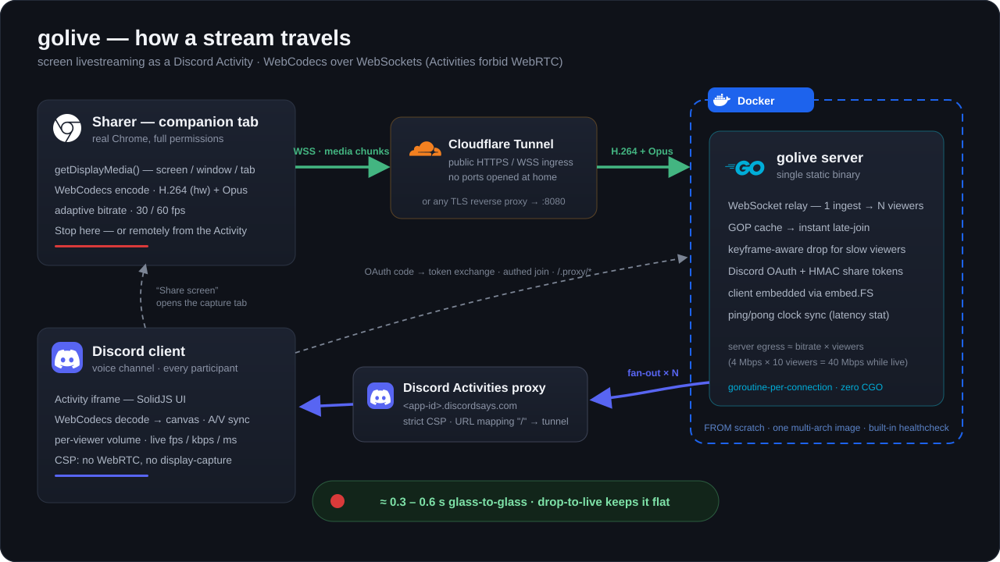

# golive

Open-source screen livestreaming as a **Discord Activity**: one participant
shares their screen (or a tab) at 30/60 fps, everyone else in the voice call
watches it live inside the Activity — with tab/system audio, live
fps/bitrate/latency stats, per-viewer volume, and a one-click "take the
stage" model.



> **Status: early development.** The relay pipeline works end-to-end in plain
> browsers; Discord-embedded operation is being validated (see
> [Roadmap](#roadmap)).

## Why not just Go Live?

Discord's built-in Go Live is great — this project exists as an open-source
**tech showcase**: proving out what a screen-streaming pipeline looks like when
built on the open web stack that Discord Activities allow. Which is a harsher
environment than you'd think:

- **WebRTC is not available inside Activities** — Discord's iframe sandbox only
  permits WebSockets/HTTPS through their proxy. golive therefore streams with
  **WebCodecs** (hardware H.264, VP8 fallback, Opus audio) over a WebSocket
  relay, targeting sub-second glass-to-glass latency.
- All traffic is forced through Discord's `*.discordsays.com` proxy with a
  strict CSP.
- **Screen capture inside the Activity iframe is blocked** — Discord's iframe
  denies the `display-capture` feature by permissions policy (verified
  empirically). golive therefore opens a **companion capture tab** in the
  sharer's real browser; the Activity stays the viewing surface for everyone.

## Architecture

```
┌─ sharer (browser/Discord) ─┐      ┌─ golive server (Go) ─┐      ┌─ viewers ─┐
│ getDisplayMedia            │  WS  │                      │  WS  │ WebCodecs │
│  └─ WebCodecs encode       ├─────►│  room fan-out relay  ├─────►│  decode   │
│     H.264/VP8 + Opus       │      │  (1 in → N out)      │      │  canvas + │
└────────────────────────────┘      └──────────────────────┘      │  audio    │
                                                                  └───────────┘
```

- **Server:** a single Go binary — WebSocket relay (one publisher per room,
  fan-out to viewers, keyframe-aware drop policy for slow consumers), Discord
  OAuth token exchange, and the client embedded via `embed.FS`.
- **Client:** SolidJS + Vite + TypeScript. Capture with `getDisplayMedia`,
  encode/decode with WebCodecs, render to canvas. Playback is decode-driven
  (not rAF-driven) so viewers keep streaming while alt-tabbed.
- **Protocol:** JSON control messages + 13-byte-header binary media chunks.
  See [`internal/protocol/protocol.go`](internal/protocol/protocol.go).

## Quick start (local, no Discord)

Requires Go 1.26+ and Node 24+.

```sh
make all                    # builds web client, embeds it, builds ./golive
GOLIVE_ALLOW_ANON=1 ./golive  # serves http://localhost:8080
```

`GOLIVE_ALLOW_ANON=1` disables join authentication for local development.
Without it, every WebSocket join must present a Discord OAuth token (verified
against Discord) or a short-lived HMAC share token minted for companion
capture tabs — the production default.

Open `http://localhost:8080/?room=demo` in two browser windows (Chromium-based
— WebCodecs required), click **Share screen** in one, watch in the other.

For development with hot reload:

```sh
go run ./cmd/golive          # terminal 1 — API + relay on :8080
cd web && npm run dev        # terminal 2 — vite on :5173, proxies /api + /ws
```

## Running as a Discord Activity

See [docs/discord-setup.md](docs/discord-setup.md) for the full walkthrough
(creating the Discord application, URL mappings, HTTPS tunnel for dev).

Short version — the published multi-arch image works for **any** Discord app
(the client id is served at runtime, nothing is baked in):

```sh
export DISCORD_CLIENT_ID=...      # from the Discord developer portal
export DISCORD_CLIENT_SECRET=...
docker compose up                  # pulls ghcr.io/pedro-hbl/golive:latest
```

Add `--profile tunnel` to also start a Cloudflare quick tunnel that exposes
the server over public HTTPS with zero configuration (the URL is printed in
the tunnel container's logs — put it in the portal's URL mapping). Use
`docker compose up --build` to build from source instead of pulling. The
container has a built-in healthcheck (`/golive healthcheck`).

## Self-hosting notes

- The server is a single process; a small VPS is plenty for one community.
- Bandwidth is the real cost: server egress ≈ stream bitrate × viewers
  (e.g. 4 Mbps × 10 viewers = 40 Mbps while live).
- Discord requires the Activity be served over HTTPS — put the server behind
  any TLS reverse proxy or a Cloudflare Tunnel.

## Roadmap

- [x] M0 — scaffold: Go relay + Solid client, local end-to-end pipeline
- [x] M1 — Activity boots inside Discord; capture spike **answered: iframe
      denies `display-capture`** → companion capture tab implemented
- [x] M2 — hardened pipeline: auto-reconnect (stage re-claimed), instant
      late-join (server GOP cache), adaptive bitrate, A/V sync, glass-to-glass
      latency in the stats readout, authenticated joins (Discord OAuth +
      signed share tokens)
- [x] M3 (partial) — remote stop from the Activity, per-viewer volume,
      crayon-drawing UI theme, drop-to-live latency bound
- [x] M4 — multi-arch Docker image on GHCR, compose healthcheck + optional
      tunnel profile, runtime client-id config (one image fits every app),
      architecture diagram
- [ ] Next — worker-based decode (background-proof viewers), participant
      avatars, take-the-stage confirm dialog, v0.1 tag

## License

[MIT](LICENSE)
